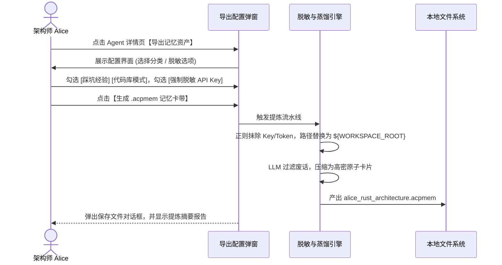

# 🥷 Shinobi / Shadow Crew 产品需求文档 (PRD)：跨端 ACP 远程连接与记忆资产流转

> **版本**：v1.0.0  
> **状态**：待评审 (Draft / Ready for Review)  
> **面向对象**：产品经理、UI/UX 设计师、前端/桌面端研发、AI Agent 研发工程师  

---

## 1. 核心愿景与产品背景

### 1.1 行业背景与痛点
在当前的 AI 辅助研发实践中，每一个资深开发者都在本地打造了自己的专属 Agent（无论是基于 Claude Code、OpenClaw 还是 Shinobi）。但这些 Agent 之间存在明显的断层：
1. **记忆孤岛（Memory Silos）**：资深工程师经过数周与 Agent 的交互，调试并调教出大量针对当前复杂工程的“暗语、架构边界、避坑指南”。新团队成员加入时，无法复用这些无形资产，必须从头踩坑；
2. **缺乏即时远程替身协同（No Remote Stand-in）**：在架构推演（RFC）会议中，外地或远程同事无法把自己身经百战的 Agent “派进”同一个讨论室为团队审查方案；
3. **传统导入方式过于粗暴（Pollution Risk）**：很多工具简单粗暴地将外部配置覆盖合并到本地，导致本地个人偏好被污染，且“请神容易送神难”，无法一键干净剥离。

### 1.2 产品定位与价值主张
Shadow Crew 致力于打造 **“可携记忆互联、可即插即拔克隆的多 Agent 替身工作台”**：
- **在线时，实时远程进房**：通过轻量网络协议，把远程同事电脑上的 ACP 引入当前研讨室；
- **离线时，非侵入式复用资产**：支持将别人的知识库打包为 **“外挂记忆卡带 (Cartridge)”** 或 **“访客替身分身 (Guest Clone)”**，本地原生库 100% 零污染，即开即用、随用随拔。

---

## 2. 功能清单与信息架构

```text
ACP 互联与资产流转中心
  │
  ├── [功能 1] 远程连接 ACP (Remote ACP Connection)
  │     ├── 局域网 / VPN 直连 (Direct WebSocket)
  │     ├── 团队中心 Hub 邀请码连接 (Relay Hub Join)
  │     └── 远程 Agent 状态与权限看门狗
  │
  ├── [功能 2] 导出指定 ACP 记忆文件 (Memory Export)
  │     ├── 导出范围筛选 (工程规范 / 用户偏好 / 踩坑历史)
  │     ├── 自动脱敏网关 (API Key & 敏感路径脱敏)
  │     └── 标准打包产物 (*.acpmem 记忆卡带)
  │
  ├── [功能 3] 导入他人 ACP 记忆能力 (Memory Ingestion)
  │     ├── 模式 A：外挂式「记忆卡带」挂载 (只读叠加，零污染)
  │     ├── 模式 B：独立「访客替身」克隆 (全新沙盒 Agent，同屏推演)
  │     └── 有限上下文下的智能 JIT 召回与按需拉取 (Token 保护)
```

---

## 3. 功能一详细规格：支持远程连接 ACP (Remote ACP Connection)

### 3.1 用户故事
> *“作为一名团队开发者，我想在研讨室中输入同事分享的连接码，将他电脑上调优好的 Claude Code 或 Shinobi Agent 远程接入我们的频道，以便让他的 Agent 实时为我们审查网络模块代码。”*

### 3.2 核心交互设计 (UI Flow)

#### 1. 建立远程连接入口 (`ConnectAgentModal.tsx`)
在「添加 / 连接 Agent」弹窗中，新增 **「连接远程 Agent」** 标签：
- **连接协议 (Transport)**：
  - `WebSocket 直连 (LAN / Tailscale)`：输入 `ws://192.168.1.55:9000`；
  - `团队 Hub 邀请码连接 (Cloud Relay)`：输入 Hub 房间邀请码，如 `room-rust-auth-9921`；
- **访问凭证 (Auth Token)**：输入由对方生成的访问密钥（可选）；
- **只读保护开关 (Read-Only Guard)**：默认开启，禁止远程 Agent 在本地写盘，仅作为方案评审参谋。

#### 2. 状态呈现与生命周期
- 成功建立 WebSocket 管道后，左上角显示 **🌐 `remote online`**（带蓝色网络波浪微光）；
- 若网络抖动断开，显示 **🟡 `reconnecting...`**，并在 3 次失败后转为 **⚪ `remote offline`**；
- 悬浮在卡片上可查看远程端延迟（如 `Ping: 42ms`）。

---

## 4. 功能二详细规格：支持导出指定 ACP 记忆能力文件 (ACP Memory Export)

### 4.1 用户故事
> *“作为一名资深架构师，我已经在当前代码库深耕了 2 个月，踩完了各种异步并发死锁的坑。我想把我的 Agent 脑中的这些避坑经验导出为一个标准文件分享给组内新人，同时确保我的私人 Token 和私密习惯不会泄漏。”*

### 4.2 导出配置流程 (`MemoryExportModal`)



### 4.3 导出物产物标准 (`.acpmem`)
- 包含标准元数据：导出人、源模型（如 `Claude 3.7 Sonnet`）、覆盖领域标签、条目数、签名哈希校验码；
- 导出的记忆条目单条平均小于 80 Tokens，剔除冗余聊天噪声。

---

## 5. 功能三详细规格：支持导入他人 ACP 记忆能力 (Memory Ingestion)

### 5.1 用户故事
> *“作为一名新加入的工程师，我拿到同事导出的 `alice_rust.acpmem` 记忆文件，我希望在本地 Agent 中借鉴他的经验，但我绝对不希望他的习惯覆盖破坏掉我本地已有的配置，且当我离开该项目时能一秒卸载。”*

### 5.2 核心模式与交互规范

导入记忆时，弹窗提供 **双轨选择**：

```text
┌─────────────────────────────────────────────────────────────┐
│ 📥 导入 ACP 记忆卡带: alice_rust_architecture.acpmem         │
├─────────────────────────────────────────────────────────────┤
│ 请选择您的使用模式：                                         │
│                                                             │
│ ○ 【模式 A】外挂到现有 Agent (推荐·零污染只读挂载)            │
│   挂载到: [ Shinobi Core (当前主力) ▾ ]                     │
│   • 本地私有数据库 0 写入，随时在抽屉中开关卸载             │
│   • 检索时智能联合，你的私有偏好始终优先                    │
│                                                             │
│ ○ 【模式 B】克隆为独立的「访客替身 Agent」                   │
│   Agent 名称: [ Alice (Rust 访客替身)                      ] │
│   • 在 Agents 列表生成全新独立卡片                          │
│   • 可以在研讨室与你自己的 Agent 并列开会、多方质询         │
└─────────────────────────────────────────────────────────────┘
```

#### 模式 A 交互（外挂记忆卡带 - Memory Cartridge）：
1. 在 [`AcpInspector.tsx`](file:///Users/xunuosi/Code/Lx/AI/shadow-crew/src/components/AcpInspector.tsx) 的 **Memory** 抽屉中，新增一个 **「外挂卡带 (Mounted Cartridges)」** 区域；
2. 每一张卡带显示为可折叠卡片，包含其专属标签（如 `#tokio` `#axum`）和条目数；
3. 右侧提供一个 **Toggle 开关**（开启/停用）与一个 **卸载图标（Eject）**；
4. 取消勾选或点击弹出，记忆立即卸载，**本地没有任何垃圾数据留存**。

#### 模式 B 交互（独立访客替身 - Guest Alter-Ego）：
1. 在 Agent 卡片看板上生成一张全新的卡片，卡片右上角带有专属的 **🪪 Guest 访客徽章**；
2. 在研讨室（Channel Timeline）的提问框中，支持 `@Alice_Clone` 与 `@Shinobi` 同场竞技，分别代表“外部专家经验”与“你本人的专属逻辑”。

### 5.3 有限上下文窗口下的防塞爆体验 (Context Guard)
- **拒绝全量堆叠**：系统**绝不**在对话启动时把整张卡带几十条记忆塞入 Prompt；
- **前端指示透明化**：在 Agent 回复消息下方，渲染极简的引用徽标：
  > 💡 *引用了外挂卡带「Alice_Rust」中的 2 条架构避坑经验（消耗 210 Tokens）*
- **一键查看引用详情**：点击徽标展开具体引用的记忆卡片，清清楚楚，拒绝黑盒。

---

## 6. 异常边界与容错体验设计

| 异常场景 | 系统判定 | 用户端处理与提示 |
| :--- | :--- | :--- |
| **远程连接断开** | WebSocket 连接断开或超时 | 卡片标记为 `reconnecting`，重试 3 次后提示“远程 Agent 已离线，是否降级为本地模拟推演？” |
| **导入版本不兼容** | 导入的 `.acpmem` 格式版本过高 | 弹出提示：“此记忆卡带版本为 v2.0，当前客户端支持最高 v1.0，请更新 Shadow Crew 客户端” |
| **导入含敏感 Key** | 扫描到未完全脱敏的 `sk-*` | 阻断导入并弹窗预警：“检测到包含疑似敏感 API 凭证，已为您自动抹除或请确认是否继续” |
| **检索无匹配** | 用户问及与卡带无关的内容 | 检索器命中数为 0，零额外 Token 开销，静默走正常大模型推理逻辑 |

---

## 7. 成功指标与交付标准 (KPIs & Acceptance Criteria)

1. **零污染验证**：使用模式 A 挂载记忆并完成 10 轮对话后，比对本地 SQLite 数据库哈希，要求原数据库 **0 增量写入**；
2. **上下文膨胀率**：单次检索注入的外部记忆 Token 总量严格限制在 **≤ 1,200 Tokens**（不超过主流窗口的 1%）；
3. **连通率与延迟**：远程 ACP 在百兆公网中转环境下，端到端首字响应延迟（TTFT）相比本地模式增加 **< 200ms**；
4. **一键撤销有效性**：关闭外挂卡带后，后续相同提问中不再召回该卡带的任何内容。
