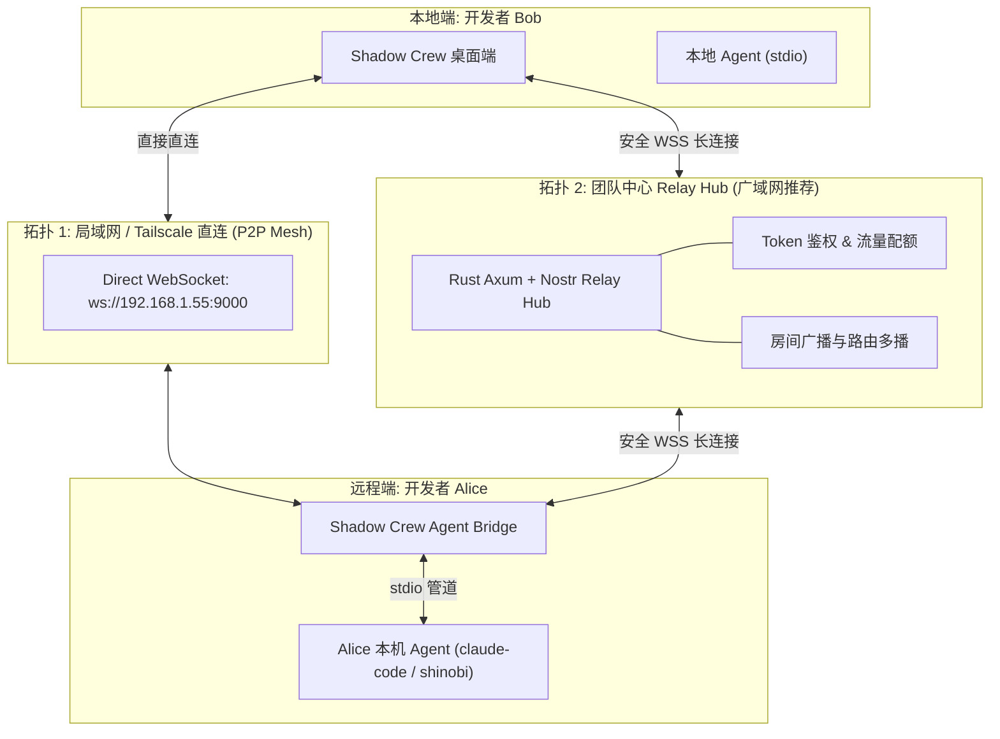
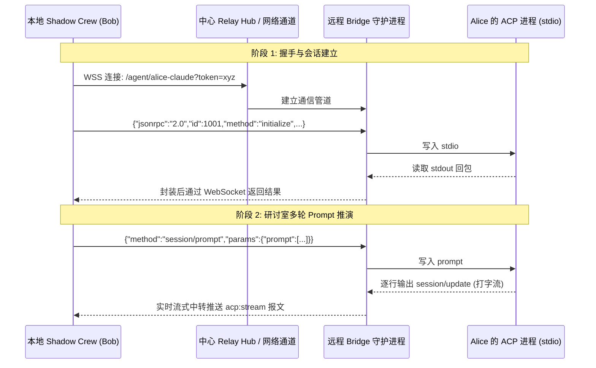
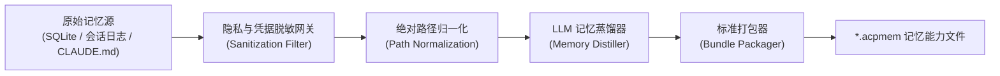
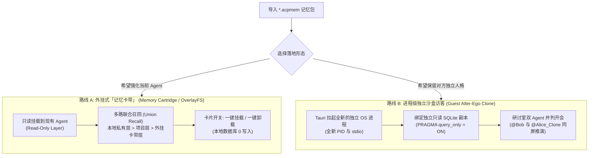
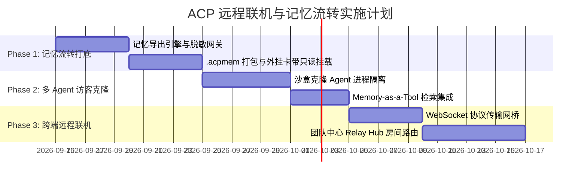

# 🥷 Shinobi / Shadow Crew 技术架构规范：跨端远程 ACP 连接与非侵入式记忆流转系统

> **文档版本**：v1.0.0  
> **状态**：技术提案与架构规范 (Technical Specification)  
> **面向对象**：系统架构师、Tauri/Rust 工程师、全栈前端、AI Agent 研发工程师  

---

## 1. 架构背景与核心设计原则

在 Shadow Crew 的多 Agent 协同体系中，**“AI 影替身 (The Ninja Alter-Ego)”** 的核心价值在于：每个开发者进房协同推演时，能携带着自己沉淀的私有记忆、专属规则与工程习惯。

为了打破单机孤岛，支持团队间的高效协同，系统需要具备两项互补能力：
1. **在线实时联机 (Live Remote Alter-Ego)**：直接将远处同事正在运行的 ACP 进程拉入本地研讨室共同推演；
2. **离线资产流转 (Offline Memory Ingestion)**：将他人经过长时间踩坑调优沉淀的记忆，以**零侵入、零污染、即插即拔**的形式复用到本地环境中。

### 核心架构原则
- **零污染原则 (Zero-Contamination)**：外部引入的记忆**严禁物理混入**本地主 Agent 的私有数据库，必须物理隔离、支持一键卸载；
- **传输抽象原则 (Transport Agnostic)**：ACP 核心业务报文与通信介质解耦，透明支持 `stdio`、`websocket` 与 `relay_hub`；
- **上下文经济原则 (Context Budgeting)**：无论外部记忆库有多庞大，注入到 Prompt 窗口中的前置 Token 必须受到严格硬配额保护，主流采用 **按需拉取 (Pull / Memory-as-a-Tool)** 代替全量推送 (Push)。

---

## 2. 功能一：支持跨端远程连接 ACP (Remote ACP Connection)

### 2.1 网络拓扑设计

针对开发者所处的复杂网络环境（家庭内网、公司防火墙、无公网 IP），系统设计了双模网络传输拓扑：



1. **局域网/网格直连 (Direct LAN / Tailscale Mesh)**：
   - 适用场景：同办公室局域网，或双方均已安装 Tailscale/WireGuard 网格 VPN；
   - 机制：远程端暴露本地 WebSocket 端口，本地端直接发起 TCP/WS 连接，**0 中心服务开销**。
2. **中心 Relay Hub 中转模式 (Message Relay Hub - 广域网首选)**：
   - 适用场景：跨互联网远程办公、开源协同；
   - 机制：基于项目已预留的 `crates/shinobi-server`（Rust Axum + Nostr Relay）：
     - Alice 的 Bridge 与 Bob 的桌面端均以客户端身份向 Hub 建立外连 WebSocket；
     - 彻底规避 NAT 打洞与路由器端口映射问题；
     - Hub 提供房间号（Channel ID）消息多播，保障多人同时与该 Agent 交互。

### 2.2 协议传输桥接层 (Transport Bridge)

官方 ACP 默认绑定在 `stdio`，跨网络传输通过轻量 Bridge 实现透明封包：



### 2.3 安全准入与配额护栏 (Security Guard)
1. **动态访问令牌 (Ephemeral Token)**：分享方在导出连接时生成限时 Token（如 8 小时有效、限定 50 轮对话）；
2. **工具权限沙盒隔离**：远程 Agent 在被他人调用时，默认强制禁用危险的 Bash 执行权限，仅放行代码分析和只读检索。

---

## 3. 功能二：ACP 记忆导出与打包引擎 (Memory Export Engine)

### 3.1 记忆的三层解构

```text
原始海量会话流 (Transcripts) ➔ 离线提炼蒸馏 (Distillation) ➔ 结构化原子记忆 (Atomic Facts)
```

1. **显式工程规范 (Explicit Rules)**：`CLAUDE.md`、`.claude/settings.json`；
2. **结构化持久记忆卡片 (Memory Records)**：`codebase_pattern`、`user_preference`、`incident_history`；
3. **会话历史轨迹 (Session Transcripts)**：长程 Tool Calls 与问答流。

### 3.2 离线记忆蒸馏与脱敏过滤流水线



#### 关键处理管道：
1. **凭证脱敏 (Secrets Stripping)**：
   - 使用正则深度过滤 `sk-ant-*`、`ghp_*`、`Bearer *`、私钥证书、内部敏感域名前缀；
2. **路径归一化 (Path Normalization)**：
   - 将原宿主机绝对路径（如 `/Users/alice/projects/shadow-crew/src`）全局替换为环境变量占位符 `${WORKSPACE_ROOT}/src`；
3. **记忆提炼蒸馏 (LLM Distillation)**：
   - 过滤掉 90% 的废话日志，提炼为精炼的高密度原子知识卡片（Atomic Fact Cards）。

### 3.3 `.acpmem` 标准记忆包格式规范

导出文件为标准 ZIP 压缩包或 JSON 文件（命名规范：`<agent_name>_<topic>_<timestamp>.acpmem`）：

```json
{
  "manifest": {
    "format_version": "1.0.0",
    "exported_at": "2026-09-12T22:30:00Z",
    "source_agent": {
      "name": "Alice's Claude Code",
      "model": "Claude 3.7 Sonnet",
      "role": "Rust Systems Architect"
    },
    "checksum": "sha256:4f8a9b1c..."
  },
  "metadata": {
    "description": "经过 2 个月项目深耕沉淀的 Rust 异步运行时避坑指南与架构规约",
    "total_records": 42,
    "tags": ["rust", "tokio", "axum", "sqlite"]
  },
  "memories": [
    {
      "id": "incident:tokio_await_in_sync_lock",
      "category": "incident_history",
      "key": "tokio_deadlock_sync_mutex",
      "content": "在 Rust 异步函数中，严禁持有 std::sync::MutexGuard 跨越 .await，必须使用 tokio::sync::Mutex",
      "importance": 0.95
    },
    {
      "id": "pattern:error_handling",
      "category": "codebase_pattern",
      "key": "error_handling_rule",
      "content": "核心模块严禁 unwrap()，统一返回 anyhow::Result 或自定义 thiserror 枚举",
      "importance": 0.9
    }
  ]
}
```

---

## 4. 功能三：非侵入式记忆导入与多 Agent 协同体系

### 4.1 为什么坚决拒绝直接覆盖导入（Direct Overwrite）？
- **记忆污染 (Contamination)**：无法分清哪些是本地主人的偏好，哪些是外来的，且随着时间推移产生逻辑冲突；
- **不可逆 (No Rollback)**：一旦合并，无法一键卸载或停用；
- **缺乏上下文边界**：A 项目的经验不应该污染 B 项目。

### 4.2 两种零侵入实现路线



#### 路线 A：外挂记忆卡带 (Memory Cartridge)
- **底层原理**：保持本地 `shinobi_agent_memory.db` 完全不改写。在检索时，内存中挂载外挂只读 Provider，做多路联合召回（Union Recall）；
- **用户体验**：在 ACP Inspector 中作为一个外挂卡带开关，随时可勾选开启，随时可取消勾选卸载。

#### 路线 B：进程级沙盒访客克隆体 (Guest Alter-Ego Clone)
- **底层原理**：在 Tauri 后端（[`acp_manager.rs`](file:///Users/xunuosi/Code/Lx/AI/shadow-crew/src-tauri/src/acp_manager.rs)）中注册一个全新的 `agent_id`（如 `agent-clone-alice-01`）；
- **存储沙盒**：解压记忆包到沙盒目录，启动子进程时注入 `SHINOBI_MEMORY_DB=<alice_sandbox.db>` 并开启只读锁；
- **业务协同**：在多人研讨室中，既能 @ 本地纯净的自己 Agent，也能 @ 克隆访客 Agent，双方拥有完全独立的思考链。

---

## 5. 核心攻坚：海量记忆在有限上下文（Token Budget）下的精细引入

### 5.1 上下文矛盾与核心挑战
别人长达几个月的交互历史可能多达几百万 Token，直接塞进 Prompt 窗口会导致：
1. **物理窗口溢出或高昂费用**；
2. **大模型注意力衰减（Lost in the Middle）**；
3. **无关信息误导当前决策**。

### 5.2 四级记忆漏斗机制 (The 4-Stage Memory Funnel)

系统采用 **“分层精炼 + 按需动态拉取 (Pull)”**，彻底颠覆传统的全量前置推送：

```text
[海量原始数据 (100MB+)] 
   ⬇ (离线提炼)
[结构化高密卡片库 (120 条，约 150KB)]
   ⬇ (按需多路检索 / 关键词+向量)
[动态 JIT 召回条目 (Top-3，仅 300~600 Tokens)]
   ⬇ (或通过工具自主拉取)
[Memory-as-a-Tool (前置 0 Token 开销，自主调用)]
```

#### 机制一：动态即时召回 (Just-In-Time Semantic Recall)
- 用户未提及相关领域时，外部记忆注入数为 0；
- 用户提及“网络重连”时，检索器从 SQLite 捞出 2 条最相关的踩坑公理，**仅消耗 200 Tokens**。

#### 机制二：记忆工具化 (Memory-as-a-Tool / 0 Token 前置开销)
将外部记忆库封装为一个只读 ACP Tool / MCP 工具：
```json
{
  "name": "query_alice_memory_bank",
  "description": "查阅 Alice 沉淀的专属架构经验与踩坑记录。遇到特定复杂模块时调用。",
  "parameters": {
    "type": "object",
    "properties": {
      "query": { "type": "string" }
    },
    "required": ["query"]
  }
}
```
- **前置 Prompt 消耗**：**0 Tokens**；
- **运行期**：仅当 Agent 推理遇到瓶颈时，自主发起工具查询，查出什么才将什么加入上下文。

#### 机制三：严格的上下文硬配额 (Token Budget Allocator)

```text
┌──────────────────────────────────────────────────────────┐
│ Context Window (例如 128,000 Tokens)                     │
├─────────────────┬────────────────┬───────────────────────┤
│ 基础人设 (~200) │ 外挂记忆配额   │ 代码区 & 大模型推演   │
│                 │ (硬上限 1,200) │ 自由空间 (98%+)       │
└─────────────────┴────────────────┴───────────────────────┘
```

---

## 6. 数据模型与 Tauri IPC 接口设计

### 6.1 Rust 数据结构 ([acp_manager.rs](file:///Users/xunuosi/Code/Lx/AI/shadow-crew/src-tauri/src/acp_manager.rs))

```rust
/// 记忆卡带清单
#[derive(Debug, Clone, Serialize, Deserialize)]
pub struct MemoryCartridgeManifest {
    pub id: String,
    pub name: String,
    pub author: String,
    pub description: String,
    pub total_records: usize,
    pub categories: Vec<String>,
    pub file_path: String,
    pub is_enabled: bool,
}

/// 远程 ACP 连接配置
#[derive(Debug, Clone, Serialize, Deserialize)]
pub struct RemoteAcpEndpointConfig {
    pub endpoint_url: String, // wss://hub.shadowcrew.ai/... 或 ws://192.168.1.55:9000
    pub auth_token: Option<String>,
    pub channel_id: String,
    pub timeout_seconds: u64,
}
```

### 6.2 Tauri Commands 定义 ([main.rs](file:///Users/xunuosi/Code/Lx/AI/shadow-crew/src-tauri/src/main.rs))

```rust
// 1. 导出指定 Agent 的记忆包 (带脱敏与格式化)
#[tauri::command]
async fn export_agent_memory_bundle(
    agent_id: String,
    target_path: String,
    include_categories: Option<Vec<String>>,
    anonymize: bool,
) -> Result<String, String>;

// 2. 以“外挂卡带”方式只读挂载记忆
#[tauri::command]
async fn attach_memory_cartridge(
    agent_id: String,
    cartridge_file_path: String,
) -> Result<MemoryCartridgeManifest, String>;

// 3. 以“独立访客替身”方式克隆 Agent
#[tauri::command]
async fn spawn_cloned_guest_agent(
    source_bundle_path: String,
    guest_agent_name: String,
    app_handle: AppHandle,
) -> Result<AgentRuntimeStatus, String>;

// 4. 连接远程 ACP WebSocket / Hub 代理
#[tauri::command]
async fn connect_remote_acp_agent(
    config: RemoteAcpEndpointConfig,
    app_handle: AppHandle,
) -> Result<String, String>;
```

---

## 7. 演进实施路线图


