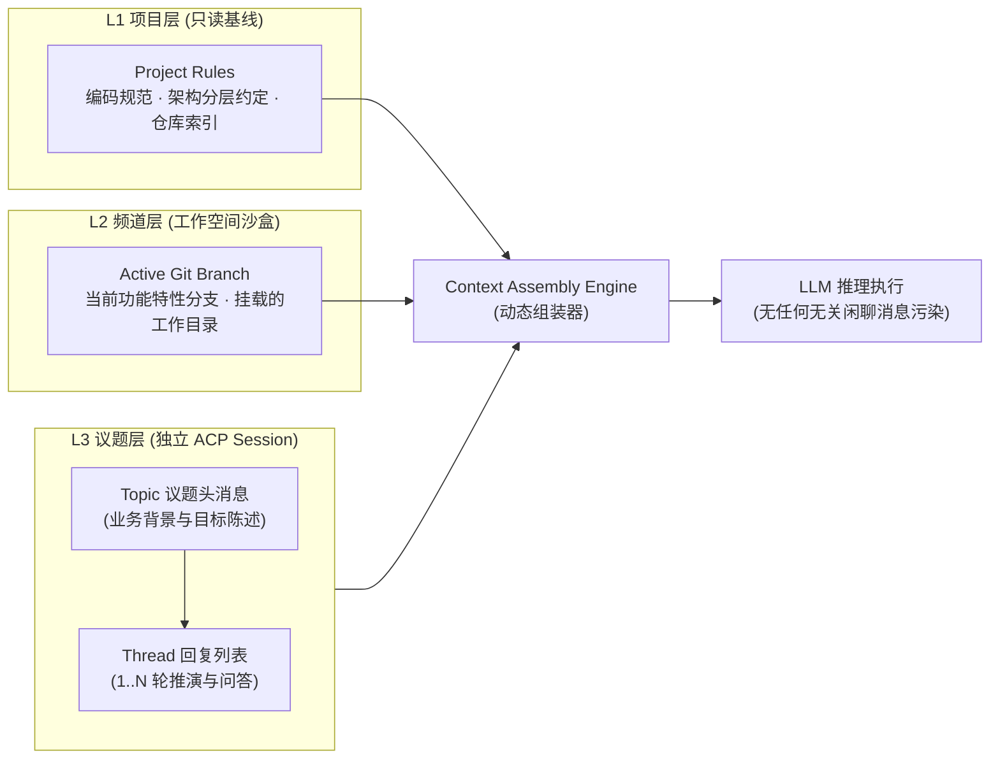

# 🛠️ Shinobi Agent 协同讨论工作台：技术架构与协议设计 (Tech Spec)

> **版本**：v1.0.0  
> **状态**：已评审 (Approved)  
> **面向对象**：系统架构师、全栈研发工程师、Rust / ACP 协议开发人员  

---

## 1. 架构总览与设计原则

Shinobi 采用 **Rust 内核 + Tauri 桌面端 + Axum Nostr Relay + ACP (Agent Client Protocol)** 的全栈架构。

```text
┌──────────────────────────────────────────────────────────────────────────────────────────┐
│                                Shinobi Desktop (Tauri v2)                                │
│   ┌──────────────────────────────────────────────────────────────────────────────────┐   │
│   │ UI 层 (React 19 + Tailwind CSS + Lucide)                                         │   │
│   │  • Project / Channel 导航树                                                      │   │
│   │  • Main Stream (普通消息 + Topic 议题卡片)                                       │   │
│   │  • Topic Thread Drawer (单层闭环推演面板 + Unified Diff 审查)                    │   │
│   └────────────────────────────────────────┬─────────────────────────────────────────┘   │
│                                            │ Tauri IPC (Channel 流式打字)                │
│   ┌────────────────────────────────────────┴─────────────────────────────────────────┐   │
│   │ Tauri Rust 宿主内核 (src-tauri)                                                   │   │
│   │  • Context Assembly Engine (按 SessionScope::Thread 组装提示词)                  │   │
│   │  • ACP Manager: 独立 Session 派生与进程管理                                      │   │
│   └───────────────────────────────────┬──────────────────────────────────────────────┘   │
└───────────────────────────────────────┼──────────────────────────────────────────────────┘
                                        │ WebSocket (Nostr Kind 40002 / 40901)
                                        ▼
┌──────────────────────────────────────────────────────────────────────────────────────────┐
│                     Shinobi 本地/团队 Relay (Axum + Tokio Broadcast)                     │
│  • 基于 Nostr NIP-01 / NIP-29 事件模型，存储与分发 Project / Channel / Thread 消息       │
│  • secp256k1 签名鉴权，保证人机行为全链路可溯源、不可伪造                                │
└──────────────────────────────────────────────────────────────────────────────────────────┘
                                        ▲
                                        │ stdio JSON-RPC 2.0 (ACP)
┌───────────────────────────────────────┴──────────────────────────────────────────────────┐
│                     ACP Agents (开发者影替身 / 专业领域 Agent)                            │
│  • 隔离运行于各自的 Session 沙盒中 (SessionScope::Thread)                                │
│  • 挂载私有 Memory (SQLite) + 团队 MCP 工具 (shinobi-dev-mcp)                             │
└──────────────────────────────────────────────────────────────────────────────────────────┘
```

### 核心技术原则
1. **SessionScope::Thread 隔离律**：Agent 参与讨论的最小会话上下文边界永远是 **单个 Topic Thread**。禁止跨 Topic 自动串流，禁止频道普通闲聊消息无过滤注入。
2. **单层 Thread 闭环律**：数据结构中不设多层级嵌套指针，Nostr 标签仅包含 `root` 与 `reply` 两种层级标记。
3. **协议驱动 (Protocol-First)**：前端与后端、客户端与 Agent 之间严守 `crates/shinobi-protocol` 强类型契约。

---

## 2. 领域数据模型 (Domain Model)

### 2.1 Rust 核心协议定义 (`crates/shinobi-protocol`)

```rust
use serde::{Deserialize, Serialize};

/// 1. 项目实体 (顶级工作空间边界)
#[derive(Debug, Clone, Serialize, Deserialize)]
pub struct ProjectEntity {
    pub id: String,
    pub name: String,
    pub description: String,
    pub repo_url: Option<String>,
    pub local_workspace_root: String,
    pub assigned_agent_pubkeys: Vec<String>,
    pub created_at: u64,
}

/// 2. 频道实体与生命周期状态
#[derive(Debug, Clone, Serialize, Deserialize, PartialEq, Eq)]
#[serde(rename_all = "snake_case")]
pub enum ChannelStatus {
    Active,   // 正常活跃状态
    Archived, // 已归档 (只读保留)
    Deleted,  // 已删除 / 销毁
}

#[derive(Debug, Clone, Serialize, Deserialize)]
pub struct ChannelEntity {
    pub id: String,
    pub project_id: String,
    pub creator_pubkey: String,           // [准入核心] 频道创建者公钥 (拥有管理与删除权限)
    pub name: String,
    pub kind: ChannelKind,
    pub status: ChannelStatus,            // [生命周期] 活跃 / 归档 / 已删除
    pub description: String,
    pub active_git_branch: Option<String>,
    pub member_pubkeys: Vec<String>,      // [准入核心] 成员公钥列表 (初始默认仅包含 [creator_pubkey])
    pub is_private: bool,                 // 默认 true (受邀准入制，非全员公开)
    pub created_at: u64,
    pub deleted_at: Option<u64>,          // 销毁时间戳 (软删除审计与级联清理)
}

/// 3. Topic 议题状态机
#[derive(Debug, Clone, Serialize, Deserialize, PartialEq, Eq)]
#[serde(rename_all = "snake_case")]
pub enum TopicStatus {
    Open,          // 待研讨 / 开放中
    Investigating, // 正在推演 (Agent 或人类正在执行或讨论)
    Resolved,      // 已达成共识并解决
    Archived,      // 已归档
}

/// 4. 结构化消息实体
#[derive(Debug, Clone, Serialize, Deserialize)]
pub struct ChannelMessage {
    pub id: String,
    pub project_id: String,
    pub channel_id: String,
    pub pubkey: String,
    pub author_name: String,
    pub is_agent: bool,
    pub content: String,
    
    /// 核心区分：是否为 Topic 议题头
    pub is_topic_head: bool,
    pub topic_title: Option<String>,
    pub topic_status: Option<TopicStatus>,
    
    /// 若非空，表示该消息是某个 Topic 内部的 Thread 回复
    pub thread_root_id: Option<String>,
    
    /// 结构化决策沉淀 (若该回复沉淀了共识)
    pub consensus_summary: Option<String>,
    
    pub created_at: u64,
    pub sig: String,
}
```

### 2.2 前端 TypeScript 类型定义 (`src/types.ts`)

```typescript
export type ChannelKind = 'feature' | 'requirement' | 'task';
export type TopicStatus = 'open' | 'investigating' | 'resolved' | 'archived';

export interface Project {
  id: string;
  name: string;
  description: string;
  repoUrl?: string;
  localWorkspaceRoot: string;
  assignedAgentIds: string[];
  createdAt: number;
}

export type ChannelStatus = 'active' | 'archived' | 'deleted';

export interface Channel {
  id: string;
  projectId: string;
  creatorId: string;           // 频道创建者 ID (Owner，具备删除权限)
  name: string;
  kind: ChannelKind;
  status: ChannelStatus;       // 'active' | 'archived' | 'deleted'
  description: string;
  activeGitBranch?: string;
  memberIds: string[];         // 成员 ID/Pubkey 列表 (初始默认仅为 [creatorId])
  isPrivate: boolean;          // 默认 true (受邀准入)
  createdAt: number;
  deletedAt?: number;          // 销毁时间
  unreadCount?: number;
}

export interface Message {
  id: string;
  projectId: string;
  channelId: string;
  authorId: string;
  authorName: string;
  isAgent: boolean;
  agentRole?: string;
  content: string;
  
  // Topic 头信息
  isTopicHead?: boolean;
  topicTitle?: string;
  topicStatus?: TopicStatus;
  
  // Thread 关联
  threadRootId?: string; // 为空表示主频道消息；有值表示 Topic 内部回帖
  
  // 结构化与推演产物
  thinkingProcess?: {
    duration: string;
    summary: string;
    detail: string;
  };
  diffView?: {
    filename: string;
    additions: number;
    deletions: number;
    diff: string;
  };
  consensusSummary?: string; // 议题结案时的共识卡片摘要
  
  timestamp: string;
  signedNostrHash?: string;
}
```

---

## 3. Nostr 线协议与事件标签标准 (Nostr Wire Protocol)

为了保持与 Buzz 生态标准互通，且具备分布式加密防篡改能力，底层全面采用 Nostr Event：

### 3.1 事件 Kind 映射表
- **`Kind 40`**：Channel Metadata / Create Event（频道创建事件，携带 `creator_pubkey`）。
- **`Kind 5`**：`KIND_DELETION`（NIP-09: 频道删除 / Tombstone 墓碑事件，仅 Owner/Admin 签名有效）。
- **`Kind 8000`**：`KIND_MEMBER_ADDED`（受邀准入事件，由 Owner/Admin 显式向 Channel 添加成员或 Agent）。
- **`Kind 8001`**：`KIND_MEMBER_REMOVED`（成员移除事件）。
- **`Kind 40002`**：Stream Channel Message（流式频道消息，包含普通消息与 Topic 消息头）。
- **`Kind 40008`**：Stream Diff Message（代码补丁与 Unified Diff 消息）。
- **`Kind 40901`**：Topic Summary / Consensus Record（议题解决与共识沉淀事件）。

### 3.2 Nostr Event 标签规则 (Tags Specification)

#### Case A：普通主频道消息 (Normal Message)
```json
{
  "kind": 40002,
  "content": "联调服务器已就绪，大家可以开始测试了。",
  "tags": [
    ["project", "proj_core_engine"],
    ["e", "chan_feat_auth", "", "root"]
  ]
}
```

#### Case B：Topic 议题头发起 (Topic Head Message)
```json
{
  "kind": 40002,
  "content": "【技术议题】关于扫码登录并发回调的状态机设计与幂等性保障...",
  "tags": [
    ["project", "proj_core_engine"],
    ["e", "chan_feat_auth", "", "root"],
    ["topic", "true"],
    ["topic_title", "扫码登录回调状态机设计"],
    ["topic_status", "open"]
  ]
}
```

#### Case C：Topic 内部 Thread 讨论回帖 (Thread Reply)
```json
{
  "kind": 40002,
  "content": "@Architect-Agent 建议增加基于 Redis 的 10s 分布式防重锁。",
  "tags": [
    ["project", "proj_core_engine"],
    ["e", "chan_feat_auth", "", "channel"],
    ["e", "msg_topic_head_123", "", "reply"],
    ["p", "npub1agent_architect_..."]
  ]
}
```

#### Case D：议题结案与共识卡片回写 (Consensus Rollup)
```json
{
  "kind": 40901,
  "content": "{\"summary\": \"经论证采用 Redis SETNX 5s TTL 方案，已通过并发压测。\", \"status\": \"resolved\"}",
  "tags": [
    ["project", "proj_core_engine"],
    ["e", "chan_feat_auth", "", "channel"],
    ["e", "msg_topic_head_123", "", "root_topic"]
  ]
}
```

#### Case E：成员加入与受邀准入 (Member Admission)
```json
{
  "kind": 8000,
  "content": "Invite Sarah and Architect-Agent to channel",
  "tags": [
    ["project", "proj_core_engine"],
    ["e", "chan_feat_auth", "", "channel"],
    ["p", "npub1sarah_frontend_...", "member"],
    ["p", "npub1agent_architect_...", "bot"]
  ]
}
```

#### Case F：频道删除与销毁 (Channel Deletion / Tombstone)
```json
{
  "kind": 5,
  "content": "Delete channel feat-auth",
  "tags": [
    ["project", "proj_core_engine"],
    ["e", "chan_feat_auth", "", "channel_tombstone"]
  ]
}
```

### 3.3 Relay 准入过滤与权限控制 (Relay Admission Gate)
1. **订阅鉴权 (REQ Filter)**：客户端或 Agent 进程连接到 Relay 并请求订阅某 Channel 的事件流时，Relay 校验客户端签名的 `pubkey` 是否存在于该频道的 `member_pubkeys` 列表中。
2. **物理数据隔离**：非本频道成员无法拉取任何该 Channel 的主流消息、Topic 议题或 Thread 回帖；广播推送仅对当前成员开放。
3. **Agent 静默原则**：未加入该 Channel 的 Agent 进程甚至不会收到此频道的任何事件广播，在网络与进程层实现绝对的安静与隔离。

---

## 4. 上下文沙盒与隔离引擎 (Context Sandboxing Engine)

系统解决“多 Agent 协作时上下文膨胀与串台”的核心机制是 **三级上下文沙盒 (Three-Tier Sandbox)**：



### 4.1 频道准入与 Agent 资源调度 (Admission & Agent Dispatching)
- **非全员常驻原则**：系统严禁在创建 Channel 时向全部 Agent 进行全局广播或默认自动挂载全部 Agent。
- **调度准入表**：`src-tauri` 中的 `acp_manager` 维护 `Channel -> Vec<AgentPubkey>` 的准入映射。仅当 Agent 的 `pubkey` 被显式加入该 Channel 的 `member_pubkeys` 时：
  1. 宿主为该 Agent 下发该 Channel 绑定的工作空间分支（`active_git_branch`）；
  2. 建立该 Channel 的 Nostr 过滤监听与 stdio JSON-RPC 2.0 管道；
  3. 允许该 Channel 的 Topic Thread 派生针对该 Agent 的专属 ACP Session。
- **算力与隐私隔离**：未被加入的 Agent 不会接收该频道的任何提问，后台不产生进程开销，不消耗 Token，杜绝跨频道信息外泄。

### 4.2 提示词组装算法 (Prompt Assembly Formula)
当用户在某个 Topic Thread 内呼叫 Agent 时，宿主内核构建的上下文由且仅由以下部分组成：

$$\text{Final Prompt} = \text{System Prompt}_{\text{Project}} + \text{Workspace Preamble}_{\text{Channel}} + \text{Topic Head} + \sum_{i=1}^{N} \text{Thread Reply}_i$$

* **严格排除项**：
  1. ❌ **主频道历史聊天**：主流里团队成员的任何闲聊、通知、其他 Topic 卡片一律不装入；
  2. ❌ **并行 Topic 历史**：其他正在进行的议题中的讨论记录一律不装入；
  3. ❌ **冗余工具调用原始文本**：MCP 工具返回的大文本日志通过 AST 提取精炼摘要，防止填满 Context Window。

### 4.3 ACP Session 标识符生成契约
宿主与底层的 ACP Agent 守护进程交互时，动态计算并下发隔离的 `session_id`：
```rust
let session_id = format!("shinobi:{}:{}:{}", project_id, channel_id, topic_head_id);
```
Agent 进程针对不同 `session_id` 分配独立的内部会话缓存（Conversation Memory）和工具会话状态，保证物理级隔离。

### 4.4 窗口溢出与接力机制 (Context Handoff)
- 设定单个 Topic Thread 的 Context 警戒阈值（如当前模型上限的 $75\%$）。
- 当 Token 超标时，Agent 自动触发单向接力（`handoff`）：
  1. 保留 `Topic Head` 与最近 5 轮关键推演；
  2. 将此前的推演历史压缩为一段 `Thread Progress Summary`；
  3. 替换上下文头部并继续执行，保证 Agent 永不崩溃、上下文永不失效。

### 4.5 频道销毁时的级联回收与进程清理 (Cascading Teardown on Deletion)
当频道被 Owner 或 Admin 执行删除并经 Relay 校验合法后，系统执行三级级联资源释放：
1. **ACP Session 强制熔断**：
   - 宿主 `acp_manager` 检索当前所有匹配 `shinobi:<project_id>:<channel_id>:*` 的活动 Session。
   - 向所有相关 Agent 进程发送 JSON-RPC 2.0 取消调用并断开 stdio 读写流；若存在卡死或高负载计算，下发 `kill` 信号回收子进程。
2. **本地文件句柄与 Git 锁释放**：
   - 释放该频道对应工作目录（`workspace_root`）下的所有文件编辑锁定（File Locks）。
3. **前端状态清空与自动路由**：
   - 客户端收到 `channel_tombstone` 事件后，从侧边栏导航安全移除该频道，并清空该频道下所有消息与 Topic 内存缓存；
   - 若用户当前正聚焦于被删除的频道或其 Topic 抽屉，系统自动平滑将视图导向 Project 默认主频道。

---

## 5. ACP 接口扩展与调度流

在 `crates/shinobi-protocol/src/acp.rs` 中，对现有的 `AcpSessionPromptParams` 进行向前兼容扩展：

```rust
#[derive(Debug, Clone, Serialize, Deserialize)]
pub struct AcpSessionPromptParams {
    pub session_id: String,
    pub project_id: String,       // [新增] 项目上下文
    pub channel_id: String,       // [新增] 频道/功能上下文
    pub topic_head_id: Option<String>, // [新增] 议题头 ID (Thread Scope)
    pub workspace_cwd: String,
    pub user_query: String,
    pub conversation_history: Vec<ConversationMessage>,
}
```

---

## 6. 实施路线图 (Implementation Roadmap)

| 阶段 | 任务内容 | 影响模块 | 预期产出 |
| :--- | :--- | :--- | :--- |
| **Phase 1** | **协议与类型扩展** | `crates/shinobi-protocol`<br/>`src/types.ts` | 增加 `Project`、更新 `ChannelKind`、`is_topic_head` 及 Nostr Tags 规范。 |
| **Phase 2** | **Nostr Relay 存储与过滤** | `crates/shinobi-server` | 实现按 `project_id`、`channel_id`、`topic_id` 的多路事件索引与过滤查询。 |
| **Phase 3** | **会话沙盒引擎实现** | `crates/shinobi-agent`<br/>`src-tauri` | 实现 `SessionScope::Thread` 组装器，确保调用 ACP 时仅装配 Topic 范围上下文。 |
| **Phase 4** | **桌面端 UI 重构** | `src/components`<br/>`src/App.tsx` | 实现三栏布局：Project 切换器、Channel 列表、主频道 Topic 卡片与右侧 Thread 抽屉面板。 |
