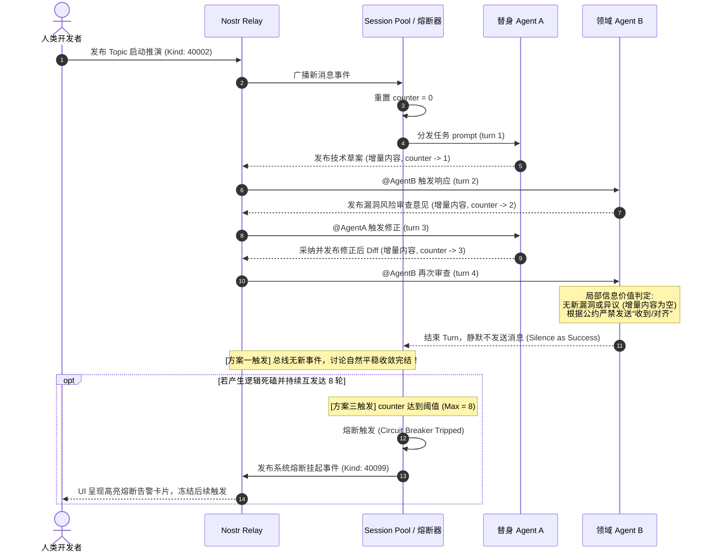
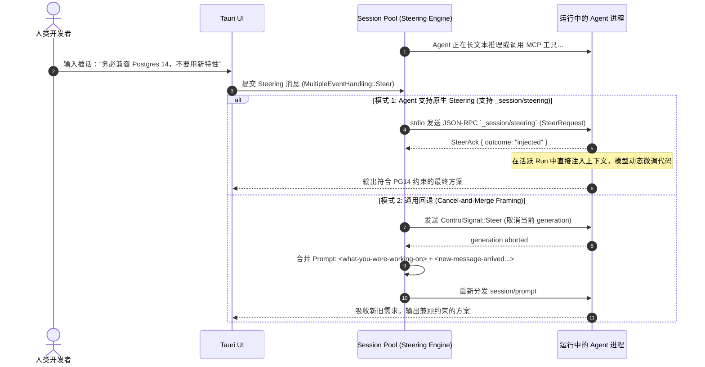

# 🛠️ Shinobi 多 Agent 协同讨论治理：技术架构与协议设计 (Tech Spec)
## —— 讨论话题轮数控制、三合一终止机制与 Steering 融合插话方案

> **版本**：v1.0.0  
> **状态**：已定稿 (Final)  
> **基于调研**：Buzz 底层引擎 (`buzz-acp`、`buzz-relay`、`queue.rs`、`pool.rs`)  
> **面向对象**：系统架构师、全栈研发工程师、Rust / ACP 协议开发人员  

---

## 1. 架构总览与时序设计 (System Architecture)

Shinobi 采用 **Rust 内核 (src-tauri) + Axum Nostr Relay + ACP Session Pool** 的全栈事件驱动架构。

```text
┌──────────────────────────────────────────────────────────────────────────────────────────┐
│                                Shinobi Desktop (Tauri v2)                                │
│   ┌──────────────────────────────────────────────────────────────────────────────────┐   │
│   │ UI 层: Topic Thread 面板 (Turns 徽章 / 熔断警示卡片 / Steering 输入控制器)       │   │
│   └────────────────────────────────────────┬─────────────────────────────────────────┘   │
│                                            │ Tauri IPC (Channel 流式打字 / Steer 信号)   │
│   ┌────────────────────────────────────────┴─────────────────────────────────────────┐   │
│   │ Tauri Rust 宿主内核 (src-tauri)                                                   │   │
│   │  • Session Pool & Concurrency Dispatcher                                         │   │
│   │  • Consecutive Turns Circuit Breaker 计数与熔断状态机                             │   │
│   │  • Steering Engine: Native RPC 注入器 + Cancel-and-Merge Framing 回退拼装器      │   │
│   └───────────────────────────────────┬──────────────────────────────────────────────┘   │
└───────────────────────────────────────┼──────────────────────────────────────────────────┘
                                        │ WebSocket (Nostr Kind 40002 / 40099 / 40003)
                                        ▼
┌──────────────────────────────────────────────────────────────────────────────────────────┐
│                     Shinobi 本地/团队 Relay (Axum + Tokio Broadcast)                     │
│  • 事件广播总线：维护 Thread 成员投递、未读计数与事件因果排序 (Causal Order)             │
│  • 熔断状态持久化：存储 Kind 40099 熔断通知事件与 Kind 40003 议题状态变更                │
└──────────────────────────────────────────────────────────────────────────────────────────┘
                                        ▲
                                        │ stdio JSON-RPC 2.0 (ACP + Steering 扩展)
┌───────────────────────────────────────┴──────────────────────────────────────────────────┐
│                     ACP Agents (开发者替身 / 专业领域 Agent 进程)                         │
│  • 隔离运行于各自的独立 Session 中 (SessionScope::Thread)                                │
│  • 挂载 Base Prompt 硬化规则：局部信息价值判定、严禁裸确认、静默即成功                   │
└──────────────────────────────────────────────────────────────────────────────────────────┘
```

### 1.1 核心交互时序图 (Mermaid Sequence)

#### 时序 A：多 Agent 自主讨论、静默收敛与熔断拦截时序



#### 时序 B：人类中途插话（Steering 融合模式）时序



---

## 2. 协议与类型契约设计 (`crates/shinobi-protocol`)

为保证 Rust 宿主内核、Relay 服务端与 ACP Agent 之间的强类型一致性，在协议层做如下扩展定义：

### 2.1 熔断配置与状态数据结构

```rust
use serde::{Deserialize, Serialize};

/// 讨论话题熔断配置
#[derive(Debug, Clone, Serialize, Deserialize)]
pub struct CircuitBreakerConfig {
    /// 连续未经人类介入的 Agent 讨论最大轮数 (默认推荐 8 轮)
    pub max_consecutive_agent_turns: u32,
    /// 单轮讨论最大执行超时时间 (秒，默认 120s)
    pub turn_timeout_secs: u64,
    /// 触发熔断后是否自动向线程广播系统警告消息
    pub broadcast_system_alert: bool,
}

impl Default for CircuitBreakerConfig {
    fn default() -> Self {
        Self {
            max_consecutive_agent_turns: 8,
            turn_timeout_secs: 120,
            broadcast_system_alert: true,
        }
    }
}

/// 讨论线程熔断健康状态
#[derive(Debug, Clone, Serialize, Deserialize, PartialEq, Eq)]
#[serde(rename_all = "snake_case")]
pub enum DiscussionHealthState {
    /// 正常推演中 (连续轮数 1 ~ 4)
    Healthy { consecutive_turns: u32 },
    /// 深度收敛中 (连续轮数 5 ~ 7)
    DeepConverging { consecutive_turns: u32 },
    /// 已触发熔断挂起 (连续轮数 >= 8)
    CircuitTripped { consecutive_turns: u32, tripped_at: u64 },
    /// 已平稳静默收敛
    SilenceResolved,
}
```

### 2.2 Steering 中断与融合模式协议定义

```rust
/// 多事件并发/中途插话处理模式
#[derive(Debug, Clone, Copy, PartialEq, Eq, Serialize, Deserialize)]
#[serde(rename_all = "kebab-case")]
pub enum MultipleEventHandling {
    /// 排队等待：正在执行的 Turn 完成后，再出队处理新事件
    Queue,
    /// Steering 融合：中途注入引导指令，将新需求与原工作融为一体 (默认推荐)
    Steer,
    /// 紧急打断：立即取消当前推演，由新输入完全覆盖替代上一任务
    Interrupt,
    /// 仅 Owner 拥有打断特权：Owner 插话则 Steer/Interrupt，其余成员排队
    OwnerSteer,
}

/// 发送给执行引擎的控制信号
#[derive(Debug, Clone, Copy, PartialEq, Eq)]
pub enum ControlSignal {
    /// Steering 融合信号
    Steer,
    /// 强制取消/终止信号
    Cancel,
    /// 打断覆盖信号
    Interrupt,
}

/// JSON-RPC 2.0 ACP 扩展: 原生 Steering 请求参数 (`_session/steering`)
#[derive(Debug, Clone, Serialize, Deserialize)]
pub struct SteerRequestParams {
    pub session_id: String,
    /// 注入的提示词文本块列表
    pub prompt_blocks: Vec<String>,
}

/// 原生 Steering 应答结构
#[derive(Debug, Clone, Serialize, Deserialize)]
pub struct SteerResult {
    /// 注入结果状态: "injected" (已融入) | "startedNewTurn" (转新轮次) | "failed"
    pub outcome: String,
}
```

### 2.3 Prompt 拼装模板契约 (Merge Framing)

当使用 Cancel-and-Merge 回退引擎时，提示词使用严格标准化的 XML-like 标签拼装，防止模型语义漂移：

```rust
/// 拼装回退 Prompt 帧结构
pub struct MergeFraming {
    pub prior_tag: &'static str,
    pub new_tag: &'static str,
    pub closing_note: &'static str,
}

impl MergeFraming {
    pub fn for_steer() -> Self {
        Self {
            prior_tag: "what-you-were-working-on",
            new_tag: "new-message-arrived-while-you-were-working",
            closing_note: "Note: A new message arrived while you were working. Continue your in-progress work and incorporate the new message if it's relevant; if it's unrelated, you may briefly acknowledge it and carry on.",
        }
    }

    pub fn for_interrupt() -> Self {
        Self {
            prior_tag: "previous-request-interrupted-before-completion",
            new_tag: "new-request-supersedes-previous",
            closing_note: "Note: The previous request was interrupted. Please address the new request.\nIf the new request is unrelated to the previous one, you may briefly acknowledge the interruption.",
        }
    }
}
```

### 2.4 议题 Agent 成员准入校验协议 (Channel-Scoped Admission Gate)

为确保“新建议题时只能拉取属于频道内的 Agent 成员”，在协议和调度层设定严格的包含性约束校验：

```rust
/// 议题创建请求参数校验
#[derive(Debug, Clone, Serialize, Deserialize)]
pub struct CreateTopicParams {
    pub channel_id: String,
    pub title: String,
    /// 指定参与该议题推演的 Agent 公钥列表 (必须是 channel.member_pubkeys 的子集)
    pub assigned_agent_pubkeys: Vec<String>,
}

/// 频道准入错误枚举
#[derive(Debug, thiserror::Error)]
pub enum AdmissionError {
    #[error("Channel not found: {0}")]
    ChannelNotFound(String),
    #[error("Agent {0} is not a member of channel {1}. Agents must already be admitted to the channel before joining its topics.")]
    AgentNotInChannel(String, String),
}

/// 准入网关：校验新建议题的 Agent 成员是否全量属于当前频道
pub fn validate_topic_agents_admission(
    channel_member_pubkeys: &[String],
    requested_agent_pubkeys: &[String],
    channel_id: &str,
) -> Result<(), AdmissionError> {
    let member_set: std::collections::HashSet<&str> =
        channel_member_pubkeys.iter().map(|s| s.as_str()).collect();

    for agent_pk in requested_agent_pubkeys {
        if !member_set.contains(agent_pk.as_str()) {
            return Err(AdmissionError::AgentNotInChannel(
                agent_pk.clone(),
                channel_id.to_string(),
            ));
        }
    }
    Ok(())
}
```

* **Relay 与调度层硬拦截**：
  1. 当客户端提交创建 Topic 事件（`Kind: 40002`，携带 `["p", "<agent_pubkey>"]`）时，Relay 拦截并执行 `validate_topic_agents_admission`，存在非频道成员直接拒收并返回错误。
  2. 桌面端 `acp_manager` 在分发 `session/prompt` 任务给 Agent 进程前，二次校验 `agent_pubkey ∈ channel.member_pubkeys`，未通过者绝不下派 Session，杜绝越权沙盒创建。

---

## 3. 三合一终止机制深度落地实现


### 3.1 方案一：基于局部信息价值（Local Information Value）的静默收敛
在 Agent 系统提示词（`base_prompt.md`）中建立不可妥协的语义硬化规范：

```markdown
### 通信与回复准则 (Communication Discipline)

1. **增量信息价值法则 (The Local Information Value Rule)**:
   - 每次处理消息时，问自己：*本次输出是否向 Thread 提供了此前不存在的新信息（如代码方案、测试结果、架构决策、真实阻碍或必要疑问）？*
   - 如果没有新信息，**必须结束本轮并保持静默**。在团队协作中，**Silence is explicitly a success**（静默即是成功）。

2. **严禁裸确认 (Prohibited Bare Acknowledgements)**:
   - 绝对禁止发送只有客套、礼貌或确认性质的无信息量消息。
   - **违规黑名单清单**："Got it", "Confirmed", "Standing by", "Aligned", "Parked", "I won't reply again", "收到", "已对齐", "好的，我先挂起"。
   - *黄金准则：如果你想发表一条声明自己“完成了确认或不再回复”的消息，这条消息本身就是绝对不应该发送的消息。*

3. **人机有别 (Human vs Agent Distinctions)**:
   - 人类对你提出的疑问，**必须**予以答复（哪怕回复“暂无新进展”）。
   - Agent 同行对你的消息，**仅在有实质增量时回复**。

4. **去 @ 叙述化 (Drop Narrative @mentions)**:
   - 仅在确实需要对方立即行动并唤醒对方时使用 `@AgentName`。
   - 在陈述背景或描述协同过程时（例如“等待 morgan 确认方案”），禁止使用 `@` 前缀，防止产生意外唤醒回路。
```

### 3.2 方案三：连续轮数计数器与熔断状态机实现
在 `Shinobi Session Pool` 中为每个活跃的 `SessionScope::Thread` 维持一个原子计数器：

```rust
use std::sync::atomic::{AtomicU32, Ordering};
use std::sync::Arc;

pub struct ThreadCircuitBreaker {
    pub thread_root_id: String,
    pub consecutive_agent_turns: Arc<AtomicU32>,
    pub max_limit: u32,
}

impl ThreadCircuitBreaker {
    pub fn new(thread_root_id: String, max_limit: u32) -> Self {
        Self {
            thread_root_id,
            consecutive_agent_turns: Arc::new(AtomicU32::new(0)),
            max_limit,
        }
    }

    /// 当有新消息到达时判定
    pub fn on_incoming_message(&self, is_human: bool) -> CircuitBreakerAction {
        if is_human {
            // 人类发言：无论之前多少轮，立即清零计数器
            self.consecutive_agent_turns.store(0, Ordering::SeqCst);
            return CircuitBreakerAction::Pass;
        }

        // Agent 发言：自增并检查
        let current = self.consecutive_agent_turns.fetch_add(1, Ordering::SeqCst) + 1;
        if current >= self.max_limit {
            CircuitBreakerAction::TripHalt {
                turns: current,
                limit: self.max_limit,
            }
        } else {
            CircuitBreakerAction::Pass
        }
    }
}

pub enum CircuitBreakerAction {
    Pass,
    TripHalt { turns: u32, limit: u32 },
}
```

* **熔断事件广播**：
  当判定返回 `TripHalt` 时，Session Pool 拒绝向下一个 Agent 下发 `session/prompt`，并向 Relay 提交一个系统级通知事件（Nostr Kind: 40099）：
  ```json
  {
    "kind": 40099,
    "content": "{\"type\":\"circuit_breaker_tripped\",\"consecutive_turns\":8,\"reason\":\"Maximum consecutive agent turns exceeded without human participation.\"}",
    "tags": [
      ["e", "<thread_root_event_id>", "root"],
      ["status", "circuit_tripped"]
    ]
  }
  ```

### 3.3 方案四：人类主持人介入强行关停 (Abort & Resolve)
在 Tauri 宿主端维护每个活跃 Session 的取消句柄（`tokio_util::sync::CancellationToken` 或进程 PID）：

```rust
/// Tauri Command: 强制终止当前议题推演
#[tauri::command]
pub async fn abort_thread_discussion(
    thread_root_id: String,
    session_pool: tauri::State<'_, Arc<SessionPoolManager>>,
) -> Result<(), String> {
    // 1. 发送硬中断信号给该线程绑定的所有正在执行的 Agent 任务
    session_pool.signal_thread_agents(&thread_root_id, ControlSignal::Cancel).await;
    
    // 2. 清理临时沙盒未提交的草稿文件
    session_pool.cleanup_ephemeral_diffs(&thread_root_id).await?;
    
    // 3. 向 Relay 广播人工终止事件
    session_pool.broadcast_thread_system_notice(&thread_root_id, "Discussion aborted by human moderator.").await?;
    
    Ok(())
}
```

### 3.4 议题开题触发：用户主动点题驱动与级联调度实现 (User-Initiated Kickoff & Cascading)

针对“创建议题时未配置细分角色”的现状，系统确立 **“用户主动开题驱动”** 机制：创建 Topic 仅完成空间注册与候选名单准入，由用户发送第一条具体分配角色的指令来正式激活 ACP 级联推演链条。

```rust
/// 用户主动发送首条议题指令，触发多智能体级联调度
pub async fn on_user_send_topic_message(
    topic_id: &str,
    channel_id: &str,
    user_prompt: &str,
    candidate_agent_ids: &[String],
    session_pool: &Arc<SessionPoolManager>,
) -> Result<(), DispatchError> {
    // 1. 从用户输入内容中解析显式 @ 的目标 Agent 列表
    let mentioned_agents = parse_agent_mentions(user_prompt, candidate_agent_ids);

    let (first_responder_id, queued_collaborator_ids) = if !mentioned_agents.is_empty() {
        // 用户显式指定了首位 Agent 及协作者
        (mentioned_agents[0].clone(), mentioned_agents[1..].to_vec())
    } else if !candidate_agent_ids.is_empty() {
        // 未显式 @ 时，默认以候选名单首位作为接收人，其余作为排队协作者
        (candidate_agent_ids[0].clone(), candidate_agent_ids[1..].to_vec())
    } else {
        tracing::warn!("No candidate agents in topic {}, awaiting explicit agent assignment.", topic_id);
        return Ok(());
    };

    // 2. 初始化议题协同级联状态机 (Collaboration Cascade)
    let cascade_id = format!("cascade-topic-{}", topic_id);
    session_pool.register_cascade(CollaborationCascade {
        cascade_id: cascade_id.clone(),
        room_id: topic_id.to_string(),
        lead_agent_id: first_responder_id.clone(),
        queued_collaborator_ids,
        depth: 1,
        max_depth: 8, // 对应方案三连续 8 轮熔断上限
    }).await;

    // 3. 向首位响应 Agent 分发 ACP session/prompt
    session_pool.dispatch_prompt_task(
        &first_responder_id,
        topic_id,
        user_prompt,
    ).await?;

    Ok(())
}
```

* **后续级联接力算法 (Cascading Turn-Taking)**：
  1. 首位 Agent 回复后，调度器扫描其输出文本中的 `@` 标记；
  2. 若存在 `@AgentB`，则将上下文组装后派发给 Agent B；
  3. 若未显式 `@` 但存在用户首轮带入的排队协作者队列（`queued_collaborator_ids`），则自动轮转至下一位协作者接力发言；
  4. 无后续目标时，协同链依据**方案一自然静默完结**，连续轮数达 8 轮时触发**方案三熔断**。

---

## 4. Steering 融合模式双轨执行引擎

当人类在 Agent 执行中途插入新指导时，调度器按照 **“优先原生 Steering ➔ 回退 Cancel-and-Merge”** 双轨策略执行：

```rust
pub async fn dispatch_mid_turn_steer(
    agent_client: &mut AcpClient,
    thread_id: &str,
    new_user_message: &str,
    current_working_context: &WorkingContext,
) -> Result<(), DispatchError> {
    // 轨 1: 检查 Agent 是否在 initialize 握手中声明了 steering 支持
    if agent_client.capabilities().supports_steering {
        let steer_params = SteerRequestParams {
            session_id: thread_id.to_string(),
            prompt_blocks: vec![new_user_message.to_string()],
        };

        // 通过 stdio 发送 JSON-RPC 2.0 "_session/steering"
        match agent_client.call_method("_session/steering", steer_params).await {
            Ok(res) if res.outcome == "injected" || res.outcome == "startedNewTurn" => {
                tracing::info!("Native steering successfully injected into agent run.");
                return Ok(());
            }
            Ok(other) => {
                tracing::warn!("Native steering rejected with outcome: {}, falling back to cancel-and-merge", other.outcome);
            }
            Err(err) => {
                tracing::warn!("Native steering call failed: {:?}, falling back to cancel-and-merge", err);
            }
        }
    }

    // 轨 2: 通用回退引擎 (Cancel-and-Merge Framing)
    tracing::info!("Executing Cancel-and-Merge fallback for thread: {}", thread_id);
    
    // 1. 中止当前的 generation
    agent_client.send_signal(ControlSignal::Steer).await?;
    
    // 2. 拼装融合 Prompt
    let framing = MergeFraming::for_steer();
    let merged_prompt = format!(
        "<{}>\n{}\n</{}>\n\n<{}>\n{}\n</{}>\n\n{}",
        framing.prior_tag,
        current_working_context.original_prompt,
        framing.prior_tag,
        framing.new_tag,
        new_user_message,
        framing.new_tag,
        framing.closing_note
    );

    // 3. 重新向 Agent 下发 session/prompt 请求
    agent_client.session_prompt(thread_id, &merged_prompt).await?;

    Ok(())
}
```

---

## 5. Nostr 事件与标签规范扩展

针对多 Agent 讨论轮数控制与中途插话，规范如下自定义 Nostr Tag：

| Tag 格式 | 含义与用途 | 适用 Kind |
| :--- | :--- | :--- |
| `["consecutive_turns", "4"]` | 当前消息发送时所处的不间断 Agent 连续轮次计数 | Kind 40002 (Stream Message) |
| `["steer_target", "<event_id>"]` | 标识该消息是针对正在运行任务的 Steering 注入指导 | Kind 40002 |
| `["steer_mode", "fusion"]` | 插话处理方式：`fusion` (融合模式) 或 `interrupt` (打断模式) | Kind 40002 |
| `["circuit_status", "tripped"]` | 熔断器触发挂起状态标识 | Kind 40099 (System Message) |
| `["fork_from", "<thread_msg_id>"]` | 标识从某条讨论消息派生出的平行侧议题 (Side-Topic) | Kind 40002 (Topic Head) |

---

## 6. 测试与验证策略 (Verification & Test Matrix)

1. **单元测试 (Unit Tests)**：
   - 验证 `ThreadCircuitBreaker` 在 1~7 轮时放行，达到第 8 轮时准确触发 `TripHalt`。
   - 验证人类发言后，计数器原子清零且立即放行。
   - 验证 `MergeFraming` 拼装出的 Prompt 标签符合严密格式规范。
2. **集成测试 (Integration Tests)**：
   - 模拟 Agent A 与 Agent B 互发纯客套词，验证 Base Prompt 拦截逻辑，确保无消息向 Relay 发出（验证静默收敛）。
   - 模拟在 Agent 生成中途（模拟 5 秒慢速输出）通过 IPC 发送 Steering 消息，验证原生注入或 Cancel-and-Merge 准确捕获新参数并调整输出。
3. **退化与鲁棒性验证**：
   - 模拟 Agent 进程卡死情况下的硬超时杀除（`turn_timeout_secs = 120s`），验证宿主进程平稳回收。
